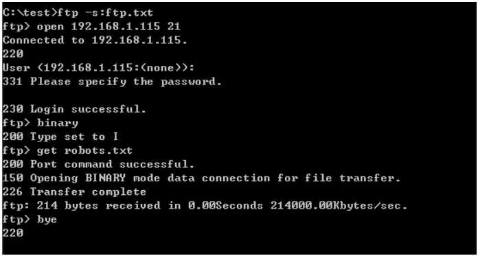
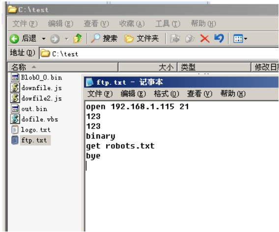

专注APT攻击与防御
https://micropoor.blogspot.com/

**windows 全平台自带ftp，在实战中需要考虑两点。**

* 数据传输的完整性。
* 代码得精简

**ftp文件的传输方式：**
* Binary ，二进制传输
* Ascii ，ascII传输

在FTP文件传输过程中，ASCII传输HTML和文本编写的文件，而二进制码传输可以传送文本和非文本（执行文件，压缩文件，图片等），具有通用性，二进制码传输速度比ASCII传输要快。，所以在建立bat脚本时，一般输入bin命令，启用二进制传输。如果用ASCII模式传输非文本文件，可能会显示一堆乱码。Ascii和binary模式的区别是回车换行的处理。binary模式不对数据进行任何处理，asci模式将回车换行转换为本机的回车字符，比如Unix下是\n,Windows下是\r\n，Mac下是\r。unix系统下行结束符是一个字节，即十六进制的0A，而ms的系统是两个字节，即十六进制的0D0A。

```bash
echo open 192.168.1.115 21> ftp.txt
echo 123>> ftp.txt //user
echo 123>> ftp.txt //password
echo binary >> ftp.txt //bin模式
echo get robots.txt >> ftp.txt
echo bye >> ftp.txt
```






>   Micropoor
