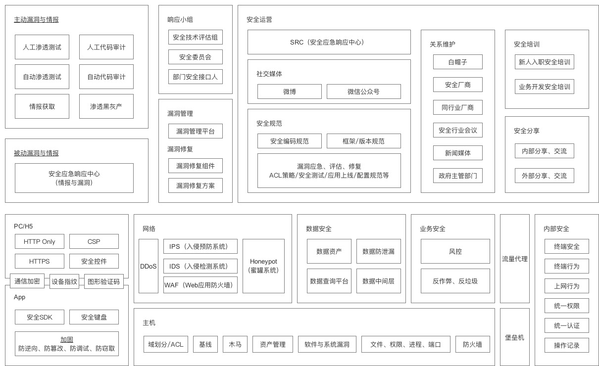

# 企业安全建设(草稿)

Feei <feei#feei.cn> 12/2017

## 0x01 理解安全意义

### 浅谈数据泄露

> 数据是互联网企业最重要资产之一

##### 广泛传播的国内互联网厂商泄露的数据
> 在2011年开始，出现大批量的网站数据库被拖并泄露出来导致大范围传播。

多玩（830w）、IS语音（969w）、凡客（20w）、一号店（90w）、当当（101w）、爱拍（1100w）、猴岛（2683w）、178游戏（907w）、CSDN（642w）、7k7k小游戏（1913w）、嘟嘟牛（1610w）、人人网（476w）、天涯（3176w）、酒店开房记录（1999w）

##### 泄露但未广泛传播的国内厂商数据
> 后续几年也陆续多家企业数据库被拖，但并未广泛传播。

微博、12306、网易、GMail、开心网、猫扑、太平洋电脑、千脑网盘、QQ群、土豆、美丽说、优酷、京东、趣店

##### 国外的数据泄露事件

> 国外则更加严峻，泄露的数据量级也更大，影响面也更广。

Yahoo（10000000w）、LinkedIn（100000000w）、Equifax（14300w）、Uber（5700w）、Edmodo（7700w）、Verizon（1400w）、DRA（19800w）、Facebook（8700w）

##### 数据泄露对于企业的影响

> 轻则影响股价、重则企业没落甚至倒闭。

除了产生直接对企业名誉上的负面影响外，还涉及持久的数据恶意利用问题。

常见的比如用来做**撞库**、**欺诈**、**广告**、**社工**等等。

##### 数据泄露原因

除了一些极端情况，比如Yahoo因为AWS bucket的密钥上传至GitHub中导致的，主要都是通过各类漏洞进入到企业服务器内部盗取数据。

##### 防护数据泄露

防护数据泄露是一个体系化的建设，无法依赖某个点、产品或项目去解决，要以**攻击视角**、**目标视角**和**结果视角**进行相对应的防御。

### 安全重视程度

> 数据泄露只是安全影响中的一种情况，没经历过可能还无法感受出威力。

##### 行业重视程度

2017年05月出现的WannaCry勒索病毒影响全球，大量政府机关、医院、公司的电脑、服务器的文件被加密，只能交赎金才能换来密钥解密文件。导致医院停诊、政府机关无法办公、公司网站和服务瘫痪，甚至很多个人电脑也中了该病毒导致数据丢失。

2017年06月国家出台网络安全法，这是国内第一部针对网络安全的法律，显示出了网络安全领域的危害程度和影响。

习近平当选国家网络安全小组组长，并表示没有网络安全就没有国家安全。

所有中大型互联网公司都有安全部门。

##### 企业内部安全重视程度

在企业内部，上层高管对于企业的安全重视程度和安全做的好不好成正比。如果不是自上而下的重视，会导致安全在后续的每一步都非常难推动。

### 假如没有安全部门

- 网络攻击
  - DDoS
  - CC
- 服务器被入侵导致被恶意利用
  - 网站被篡改
  - 代码被盗取
  - 数据库被盗取
  - 服务器被用来挖矿、种马、恶意攻击等
- 应用存在漏洞导致被恶意利用
  - 越权：查看他人信息、登陆他人账号、转走他人余额
  - 薅羊毛：利用脚本快速抢购优惠券、秒杀、红包、刮奖等
  - 恶意：刷单、套现、作弊、评价、评论、爬虫、反动、涉黄赌毒等

## 0x02 安全建设思路

### 不同阶段的不同应对方法
##### 早期

- 以资源投入来决定安全架构
- 借外力助攻，比如在三方漏洞平台收取漏洞、找安全公司进行安全众测等
- 人人都是安全工程师，向开发同学普及**日常开发中常见安全漏洞**案例
- 做一些投入少但效果明显的事情，比如**HTTP Only**、**人工审计**、**开源安全工具**等
- 一些必须提前做的事情，**邮件加固**、**组织架构/花名册信息**、**账号密码/实名认证数据库多层加密**等
- 通过制造一些实际的安全事件来推动大家的重视，比如**全员钓鱼邮件**、**从外部入侵内网**等

##### 中期

- 安全产品覆盖到所有点上
- 深入每个涉及到的点
- 持续做一些投入大而结果也突出的事情，比如**白盒源代码审计**、**黑盒漏洞扫描器**、**SRC**、**漏洞修复组件**等
- 安全规范、制度的制定与落地
- 内网类的安全风险开始处理

##### 后期

- 将点联动起来成为面
- APT
- 安全研究

### 安全准则

##### 纵深防御

每类安全产品有其优势和弱势的地方，我们要利用好优势并使用其它安全产品来弥补弱势。

比如WAF用来应急新型漏洞比推进开发人员去修复要及时的多，但弱势是误报、漏报、新型漏洞等问题无法根治，此时则可以通过黑盒扫描器、主机监控、网络最小化策略等方式实现一层层的防御，来发现、监控或减缓影响。

##### 木桶理论

安全建设是以木桶标准为基准的，即安全的能力是以最短板来确定的。无论你其它方向的安全做的多么的厉害，也无法彻底解决最薄弱的地方带来的风险。

##### 由外而内

安全建设涉及的面太广了，必须有所取舍，外部风险大于内部风险。所以在早期建设的时候，不用过分的强调内部安全。

##### 先底后上

可以通过框架层统一处理的问题，不要散到上层的业务逻辑层去修复。

##### 能口不点

可以通过防火墙解决主机间的访问限制，不要散在主机层去做。

##### 技术代替人工

能用技术手段解决的，绝不能依赖人工意识

##### 最小权限原则

所有系统设计时遵守最小权限原则，用不到的就不赋予。

##### 白名单优于黑名单

能用白名单（除了白名单都为黑名单）解决的不用黑名单。

### 认清主要问题

##### 甲方安全团队和乙方安全公司的关系？

1. 甲方安全团队和乙方安全公司是一个互补的关系
2. 乙方的安全产品只能覆盖通用场景
3. 乙方安全技术能力或许比甲方安全团队高，但乙方却服务于几十数百家甲方公司
4. 安全评估、安全推进与落地、安全运营等无法替代

##### 企业内部运维、开发与安全的关系？

1. 紧密合作互补的关系
2. 运维依赖安全制定服务器、应用规范
3. 安全依赖运维整改推进落地规范
4. 开发依赖安全发现代码和应用中的漏洞
5. 安全依赖开发修复代码中的漏洞
6. 安全依赖开发在专业技术上的支持

##### 安全团队在公司内部状态？

- 安全评估或测试时不影响正常业务和数据
- 坚守底线
- 耐心提高意识

##### 安全产品是自研、购买商业产品还是使用开源？

- 满足核心需求
- 产品代码可控（部分模型类、计算类除外）
- 数据不外传

## 0x03 安全建设实践

### 入侵生命周期

不止攻焉知防：以入侵视角做每一部分安全工作。

#### 移动端安全

- 漏洞发现与应急响应
- 防调试
  - 防进程、线程注入和附加
  - 防Hook攻击
  - 防内存Dump
  - App完整性保护
  - SO数据动态清除
  - 模拟器检测
  - 调试工具检测
- 防逆向
  - DEX文件加壳保护
  - DEX函数抽取加密
  - HTML开发框架保护
  - SO文件代码压缩混淆
  - SO文件加壳保护
  - SO库设备绑定
- 防篡改
  - 签名校验
  - 代码、资源文件、配置文件完整性校验
  - 配置文件加密
  - 数据库文件加密
  - 资源文件加密
- 防窃取
  - 本地数据加密
  - 通讯协议加密
- 主要问题和风险
  - 版本迭代导致的漏洞修复时间长
  - 加固项兼容性、稳定性测试要求高

#### 网络安全

- HTTP Only：主要解决XSS盗取用户会话问题
- CSP：在没有做到全站HTTPS前，通过CSP可以监控及防御一定的广告弹窗及部分XSS、点击劫持等问题，但对于域名的劫持跳转则无能为力。
  - 先Report Only，观察收集所有白名单域名后，再上线规则
- 全站HTTPS：全站HTTPS后，能够彻底解决网站域名劫持跳转、广告弹窗、流量嗅探等问题
- DDoS：在攻击流量如此廉价的今天，发动几十、上百G的稀松平常。面对这类攻击，自建防御无疑成本太大，很多时候是IDC都无能为力要拔你网线。云安全是防御DDoS最好的应用场景，具体可以尝试阿里云的云盾和腾讯的大禹。
- WAF
  - 拦截攻击请求：拦截常见的攻击请求，并将数据输出给业务风控使用。
  - 频率限制：主要解决各类爬虫、爆破、垃圾信息。
  - 新漏洞应急响应：出现新漏洞时，立刻通过WAF上线拦截规则，减少对于开发人员修复时间的依赖。
- IDS：监控流量中的威胁情报
  - 存在异常端口
  - 访问恶意网址（挖矿、远控等）
  - 异常流量监控
- 防火墙：最小化原则，每台机器仅允许访问业务范围内的网络。

#### 业务安全

- 风控系统
- 反作弊/反垃圾
- RASP
- 人机识别
  - 实名认证
  - 数字证书：解决设备可信问题，在15年之前可以大范围使用，之后由于Chrome不支持NPAPI插件机制导致逐渐被废弃。
  - 图形验证码
  - 滑块验证码
  - PC设备指纹
  - App设备指纹
  - 生物探针
  - 安全SDK
  - 安全键盘

#### 主机安全

- 域划分/ACL
- 主机安全Agent
  - 基线检查
  - 权限、进程、端口、账户等合规检查
  - 木马查杀
  - 资产管理
  - 软件与系统漏洞
  - 文件变动监控及阻断
  - 命令执行监控及阻断
  - 命令下发
- 堡垒机

#### 数据安全

- 数据库数据查询平台
- CMDB（数据资产管理）
- 数据查询中间件
- 敏感数据监测

#### 内部安全

- 入网管控
- 去密码化
- 终端安全
- 上网行为
- 统一权限
- 统一登录
- 操作记录
- 多重水印
- 威胁情报

### 漏洞生命周期

#### 漏洞与情报发现

**主动情报与漏洞发现**

- 情报系统
  - 黑产
  - 安全知识
  - 漏洞研究
  - 安全工具
  - 信息泄露
  - 漏洞预警
  - CVE
  - 安全新闻
  - 公司负面消息
- 白盒代码安全审计
  - 显著安全问题发现
  - 依赖安全问题发现
  - 安全问题应急
- 黑盒漏洞扫描器
  - 枚举子域名
  - GitHub敏感信息泄露监控
  - 流量代理
  - Web日志
  - 主机漏洞扫描
  - Web漏洞扫描
- 人工漏洞挖掘
- 蜜罐
- 渗透黑灰产
- 捕获攻击者社交信息

**被动情报与漏洞发现**

- 安全应急响应中心
- 安全工单平台
- 漏洞管理平台
- 安全文档中心：记录各类事件、技术、经验，减少人员变动导致的问题
  - 项目技术
  - 渗透测试
  - 移动安全
  - 安全规范
  - 安全研究
  - 公共资源

#### 应急响应小组

- 安全评测组
- 安全委员会
- 部门安全接口人

#### 漏洞管理与修复推进

- 漏洞管理平台
- 漏洞修复组件
- 漏洞修复方案

#### 安全运营

- SRC
- 新媒体
  - 微信
  - 微博
- 安全规范
  - 安全编码规范
  - 框架、版本规范
  - 漏洞应急、评估、修复规范
  - ACL策略规范
  - 安全测试规范
  - 应用上线规范
  - 软件配置规范
  - ...
- 安全培训
  - 入职安全培训：介绍安全团队的工作及意义，通过对一些因为意识问题导致的安全问题进行宣导，减少类似问题再次出现的概率。
  - 开发安全培训：对最常见的漏洞进行原理、利用方法、修复方案讲解，减少出现类似情况概率。
  - 安全意识宣导：海报、内部论坛
- 安全分享
  - 内部分享、交流
  - 外部分享、交流
- 关系维护
  - 白帽子
  - SRC厂商
  - 安全会议
  - 安全媒体
  - 政府相关部门
