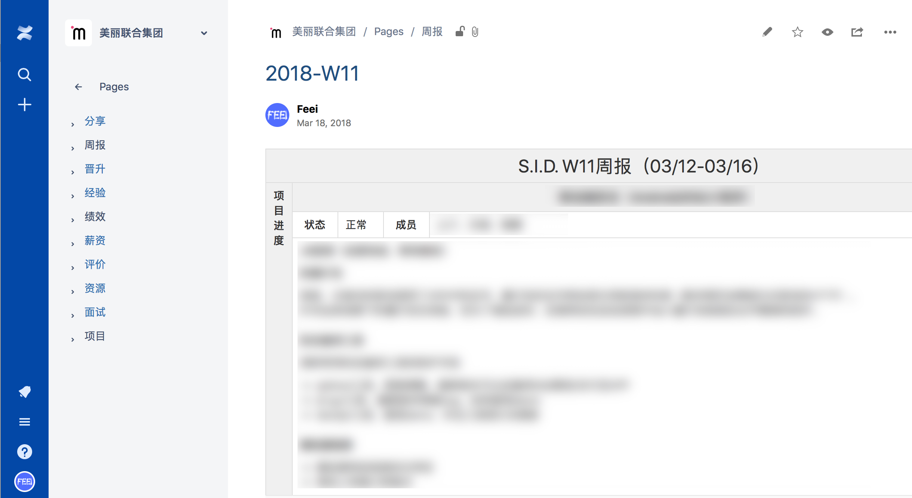

# 知识管理体系

Feei <feei#feei> 02/2018

## 0x01 知识管理

若出现过以下问题，则就遇到了知识管理的问题。

- 看过某篇文章，记不清细节，又去Google？
- 公积金号码忘记了得去问人事？
- 想知道某一周的工作内容，得去邮件中搜索？

这些内容都分散各个地方，没有统一的收集起来就行整理并沉淀，也就无法实现定期回顾就行改进提升。

## 0x02 管理方式

- 众多笔记软件（印象笔记、有道笔记、OneNote、麦库记事、为知笔记）
- wiki系统（GitBook、MediaWiki、Confluence）

在尝试试用了各类软件后，各有弊端啊，要么没有**树形结构**方便管理、要么**书写或查看体验**不好、要么**界面**还停留在上世纪。

最终选择了商业程序Confluence，大型企业几乎都在使用这套程序作为内部wiki，在多人协作、体系化内容管理和使用体验、界面效果上和其它软件不是一个阶层的。
当然价格也不是一个阶层，高达每年100美金的费用让我望而止步，于是走上了破解的道路，在自己服务器上搭建破解版本，用了超过一年后不知什么原因导致数据丢失。

于是忍痛买了在线版本，除了访问速度慢了点，没找到任何一个缺点。

## 0x03 最佳实践

整体分为了几个Space（空间）：Feei（个人）、美丽联合集团（公司）、知识库、漏洞库。

#### 工作

- 项目：记录做的各个项目成员与贡献者、功能及路线规划、工程地址、后台地址、服务器地址、立项报告、技术文档、会议记录等。
- 面试：各岗位（PHP开发工程师、Java开发工程师、信息安全工程师、安全开发工程师）的笔试题目、面试流程及面试问题。
- 资源：公司常用的各类系统、后台、Logo、软件、出口IP、VPN、代理、接口等等。
- 评价：对参与支撑的其它团队成员的工作评价；校招、社招的面试评价。
- 薪资：对自己薪资变动的记录。
- 绩效：制定团队每年、每个季度的目标（KPI）及对每年、每个季度的结果总价评价。
- 经验：电脑最佳配置、必备软件、环境配置、插件、开发环境、开发流程等新人指南。
- 晋升：记录每次晋升的PPT、事项、评审问题及不足等。
- 周报：记录每周各项目的进度与问题、遇到的风险点、技术支持、管理推进及图表分析。
- 分享：记录每次在团队内和公司外的技术分享内容及PPT，以及每次分享的优化。

#### 个人

- 文件：扫描所有合同、文件、发票等存入到一处。
- 项目：记录私人做的各个项目功能及路线规划、工程地址、后台地址、服务器地址、立项报告、技术文档、会议记录等。
- 旅游：记录去过的地方和想去的地方，记录每次出去的行程。
- 汽车：记录行驶证、驾驶证信息；上牌记录、车辆保养记录、车辆保险记录、换牌过程、违章记录等与车相关的事情。
- 房子：调研同事买的房子基本信息、买房相关知识、看房记录、装修记录、房屋尺寸、产证信息、购房事件、放款来源等于房子相关的事情。
- 财务：记录每次期权信息、固定资产情况、月固定收入项、月固定支出项、银行卡信息、负债与现金月预估。
- 研究：一些非技术性的研究，房屋买卖、感悟、方式方法、基础面分析。
- 日记：记录每日的主要事情与感悟。
- 大事件：以年为维度记录所在公司、住址、工资、成长、旅游等重大事项。
- 杂项：密码、服务器、调查等无法归类的。

#### 知识库

- 学习：书籍、电影、公开课等渠道的知识。
- 安全：安全相关的技术文章或研究。
- 技术：软件开发相关技术的文章或经验。

#### 漏洞库

- 漏洞：记录每个漏洞并配置一个编号，记录漏洞的基本信息（漏洞类型、时间、漏洞点、发现工具、代码地址、评级等）
- 厂商：记录所有厂商的反向漏洞索引、厂商的评价、漏洞提交地址、联系方式。

## 0x04 一点经验

- 不易将空间分的太细。比如单个项目最好不要分为一个空间，空间的切换的成本比较高。
- 使用内容模板。比如周报、KPI、会议记录、立项报告等都是相同格式可提前配置好模板，之后只需填写内容不用再调整格式。
- 不要什么东西都寄希望于放在这里管理。

